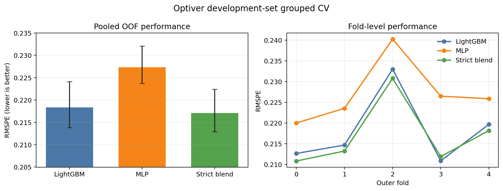

# Leakage-aware Optiver volatility research

[中文说明](README.zh-CN.md) · [Experiment results](docs/experiment_results.md) · [Reproduction guide](docs/reproducing.md) · [Architecture](docs/architecture.md)

This repository studies short-horizon realized-volatility prediction on the
[Optiver Kaggle dataset](https://www.kaggle.com/competitions/optiver-realized-volatility-prediction).
The current codebase replaces the original notebook-style scripts with a
tested, auditable pipeline built around grouped cross-validation and strict
nested ensemble calibration.

> **Current status:** research code and development-set results are complete.
> There is no independent holdout result and no frozen deployment-weight
> recipe yet.

## Main result

All scores below use five-fold grouped CV with `time_id` as the grouping unit.

| Model | Pooled OOF RMSPE | Conditional grouped-bootstrap 95% CI |
|---|---:|---:|
| Strict nested LightGBM + MLP | **0.217123** | [0.212922, 0.222404] |
| LightGBM | 0.218334 | [0.213820, 0.224134] |
| MLP | 0.227346 | [0.223732, 0.232059] |

The strict ensemble improves on LightGBM by `-0.001211` RMSPE (about `0.555%`).
Its conditional paired 95% interval is `[-0.001941, -0.000558]`.



These are **development estimates**, not unseen-test estimates. Model and
feature choices were informed by the same development dataset. See
[the limitations](docs/experiment_results.md#limitations) before quoting the
score.

The original Phase 2C experiment also tested a Ridge linear-regression stack.
It scored `0.236216` on its historical OOF inputs and did not improve either
component model. The [code and compact results](results/linear_regression_comparison/)
are retained as an exploratory comparison; that row-level KFold experiment is
not directly comparable with the strict nested headline result above.

## What changed from the original project

- Reusable code lives in `src/optiver/`; experiment entry points live in
  `scripts/`.
- Every split preserves complete `time_id` groups.
- Target-derived features are fitted only inside the applicable training fold.
- The final ensemble uses a disjoint calibration subset inside each outer
  training fold. Outer-fold labels never fit that fold's component models or
  blend weights.
- The old post-hoc OOF blend is retained only as an explicitly labelled
  exploratory analysis.
- LightGBM and PyTorch calibration jobs run in separate processes to avoid a
  macOS OpenMP runtime conflict.
- Runs write fold maps, effective parameters, file hashes, status records and
  reproducible result tables.
- The test suite currently contains 64 passing tests.

## Repository map

| Path | Purpose |
|---|---|
| `src/optiver/` | Metrics, validation, features, clustering, models and blending logic |
| `scripts/` | Command-line experiment and audit entry points |
| `tests/` | Leakage, schema, fold, provenance and numerical regression tests |
| `docs/` | Architecture, protocol, reproduction instructions and results |
| `results/` | Small, reviewable final result tables committed to Git |
| `data/` | Dataset setup instructions and the canonical feature-cache manifest |
| `legacy/` | Original exploratory scripts and figures; not the recommended pipeline |
| `artifacts/` | Generated run directories; intentionally ignored by Git |

For a file-by-file explanation, see [Architecture](docs/architecture.md).

## Quick start

Python 3.11 or newer is required.

```bash
python3 -m venv .venv
source .venv/bin/activate
python -m pip install --upgrade pip
python -m pip install -e '.[mlp,plots]'
```

The competition data is not redistributed here. Download it after accepting
the Kaggle competition rules, then place the frozen feature table at
`data/processed/features_phase2.parquet`. See [Data setup](data/README.md).

Verify the feature cache:

```bash
python scripts/verify_feature_cache.py \
  data/processed/features_phase2.parquet
```

Run the unit tests:

```bash
python -m unittest discover -s tests
```

Run the final LightGBM component:

```bash
python scripts/run_experiments.py lgbm \
  --features-path data/processed/features_phase2.parquet \
  --output-root artifacts \
  --run-name final_candidate_c1i1_leaves256_group5_seed2021 \
  --feature-set full_clean \
  --cluster-mode feature \
  --include-stock-id \
  --fixed-rounds 90 \
  --num-leaves 256 \
  --num-threads 4 \
  --seed 2021
```

The complete LightGBM, MLP and strict nested-blend sequence is documented in
[Reproducing the final result](docs/reproducing.md).

## Important interpretation notes

- `src/optiver/blending.py` and `scripts/evaluate_blend.py` are descriptive
  post-hoc tools. They do **not** produce the headline estimate.
- `src/optiver/nested_blending.py` and
  `scripts/evaluate_nested_blend.py` implement the strict headline evaluation.
- The confidence intervals condition on fitted folds, selected models and
  fitted calibration weights. They do not include the uncertainty from model
  selection or rerunning the complete study.
- No deployment weights are published because a statistically defensible
  full-data fitting recipe has not yet been frozen.

## Data and citation

The original dataset is about 2.73 GB and is licensed subject to the Kaggle
competition rules, so it is not committed to this public repository. The data
page and citation are:

> Andrew Meyer, BerniceOptiver, CameronOptiver, IXAGPOPU, Jiashen Liu,
> Matteo Pietrobon, OptiverMerle, Sohier Dane, and Stefan Vallentine. *Optiver
> Realized Volatility Prediction*. Kaggle, 2021.

This repository currently has no explicit software license. Contact the
repository owner before reusing the code outside review or replication.
