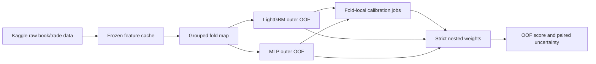

# Architecture

## Data flow

The feature cache used by the frozen experiments is described in
[`data/feature_cache_manifest.json`](../data/feature_cache_manifest.json).
Generated experiments go to `artifacts/`, while small final tables are copied
to `results/` for review.

## Library modules

| Module | Responsibility |
|---|---|
| `metrics.py` | RMSPE, RMSPE weights and grouped bootstrap intervals |
| `data.py` | Feature-table loading, key/target validation and rejection of legacy contaminated columns |
| `feature_sets.py` | Named, auditable feature groups and cumulative feature sets |
| `validation.py` | Group-preserving folds, balanced splits and cross-fitted stock statistics |
| `clustering.py` | Training-scope feature clusters and diagnostic target clusters |
| `training.py` | Grouped-CV LightGBM training, inner selection and model artifacts |
| `mlp.py` | MLP preprocessing, stock embeddings, nested epoch selection and CV |
| `baselines.py` | Raw-RV, stock-calibrated and constant benchmarks |
| `blending.py` | Descriptive post-hoc OOF blending; never the strict headline |
| `nested_blending.py` | Provenance validation and strict fold-local calibration blending |

## Command-line scripts

| Script | Use |
|---|---|
| `run_experiments.py` | Run baselines or LightGBM experiments |
| `run_mlp_experiment.py` | Run grouped-CV MLP experiments |
| `run_nested_calibration_mlp_fold.py` | Train one fold's MLP calibration component in a LightGBM-free process |
| `run_nested_calibration_fold.py` | Train one fold's LightGBM calibration component and assemble the calibration bundle |
| `evaluate_nested_blend.py` | Validate five calibration bundles and score the strict nested blend |
| `evaluate_blend.py` | Exploratory post-hoc OOF blend only |
| `evaluate_ridge_baseline.py` | Direct Ridge baseline on the 92 audited engineered features |
| `summarize_runs.py` | Align OOF runs and calculate paired comparisons |
| `verify_feature_cache.py` | Check the local feature cache against the recorded manifest |
| `plot_results.py` | Rebuild the committed model/fold comparison figure |
| `write_artifact_manifest.py` | Create a deterministic SHA-256 artifact inventory |

## Why MLP calibration is a separate process

On the development Mac, LightGBM and PyTorch loaded incompatible OpenMP
runtimes when numerical work from both libraries occurred in one interpreter.
The process sometimes hung without raising an exception. The calibration
pipeline therefore runs the MLP stage first in a process that imports no
LightGBM, then passes a hashed prediction artifact to the LightGBM bundle
builder. Regression tests enforce this import boundary.

## Legacy directory

`legacy/` preserves the original scripts and figures so the history is not
lost. Those scripts use hard-coded local paths and include methods that are no
longer valid as formal estimates. New work should use `src/` and `scripts/`.
